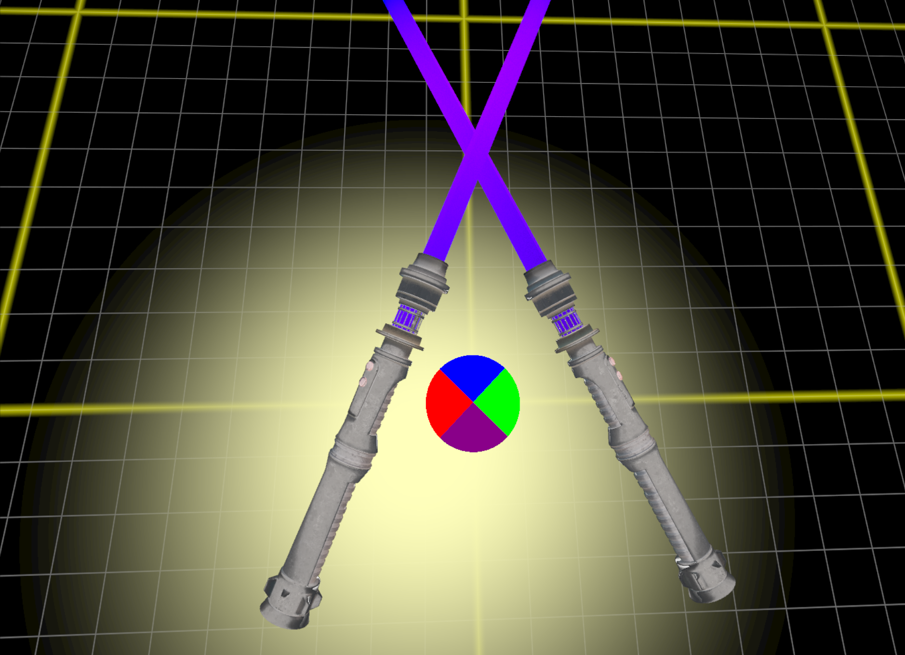

# xrlib demos
[](https://github.com/1runeberg/xrlib-demos/actions/workflows/windows_builds.yml)
[](https://github.com/1runeberg/xrlib-demos/actions/workflows/ubuntu_builds.yml)
[](https://github.com/1runeberg/xrlib-demos/actions/workflows/android_builds.yml)

A collection of demo applications showcasing the features and capabilities of the [xrlib OpenXR wrapper library](https://github.com/1runeberg/xrlib). These demos are designed to highlight a wide range of functionality, including basic runtime queries, input handling, and advanced multi-threading and rendering techniques.

The repository also includes a base class for XR applications (xrapp). This base class serves as a foundation for building XR applications, streamlining development by integrating the xrlib library and renderer.

## Demo Applications

1. [**demo-01_checkxr**](https://github.com/1runeberg/xrlib-demos/tree/main/demo-01_checkxr) 

   - Demonstrates how to query the active OpenXR runtime
   - Shows available extensions and API layers
   - Displays runtime capabilities and system information

2. [**demo-02_displayxr**](https://github.com/1runeberg/xrlib-demos/tree/main/demo-02_displayxr) -

   - Basic rendering demonstration using xrlib
   - Shows fundamental setup for XR visualization
   - Illustrates basic scene composition

3. [**demo-03_passthroughxr**](https://github.com/1runeberg/xrlib-demos/tree/main/demo-03_passthroughxr) 
   - Showcases the Facebook Passthrough extension helper class
   - Demonstrates mixed reality capabilities
   - Examples of passthrough visualization configurations

4. [**demo-04_handtrackingxr**](https://github.com/1runeberg/xrlib-demos/tree/main/demo-04_handtrackingxr) 
   - Implementation of the hand tracking extension helper class
   - Displays debug indicators matching user hand joints
   - Shows hand pose detection and tracking

5. [**demo-05_inputxr**](https://github.com/1runeberg/xrlib-demos/tree/main/demo-05_inputxr)

   

   - Comprehensive demo highlighting input handling
   - Advanced PBR (Physically Based Rendering) examples
   - Implementation of the display refresh rate extension helper class
   - Demonstrates xrlib thread pool manager for multithreading
   - Showcases best practices for XR input management

6. [**demo-06_interactionsxr**](https://github.com/1runeberg/xrlib-demos/tree/main/demo-06_interactionsxr)
 - Hand interactions demo (ext)
 - Mesh projection passthrough (via fb triangle mesh)
 - Simultaneous hands and controllers (meta)
 - Use System Properties helper to probe openxr runtime system/hardware capabilities
 
## Building

### Prerequisites

1. Required Tools
    - CMake 3.22 or higher
    - C++20 compatible compiler
    - Vulkan SDK (from [https://vulkan.lunarg.com/](https://vulkan.lunarg.com/))
    - xrlib (included as submodule)

2. Platform-Specific Requirements
    - Windows: Visual Studio 2019 or newer
    - Linux: GCC 10+ or Clang 12+
    - Android: 
        - Android Studio Ladybug or newer
        - Android NDK
        - Android native app glue

### Building Desktop Applications

1. Clone the Repository
    ```bash
    git clone [repository-url]
    cd xrlib-demos
    git submodule update --init --recursive
    ```

2. Configure and Build

#### Windows
    ```bash
    mkdir build
    cd build
    cmake ..
    cmake --build . --config Release
    ```

#### Linux
    ```bash
    mkdir build
    cd build
    cmake ..
    make
    ```

### Building Android Applications

1. Open Android Studio Ladybug or newer
2. Navigate to the `android` folder under any specific demo (e.g., `demo-01_checkxr/android`)
3. Open the folder as an Android Studio project
4. Build using Android Studio's build system

## Output Locations

After successful build, you'll find the outputs in:
- Desktop binaries: `./bin/`
- Android APKs: In respective `android/app/build/outputs/apk` directories

## Links

- GitHub: https://github.com/1runeberg
- Website: http://runeberg.io
- Social: https://runeberg.social
- YouTube: https://www.youtube.com/@1RuneBerg
