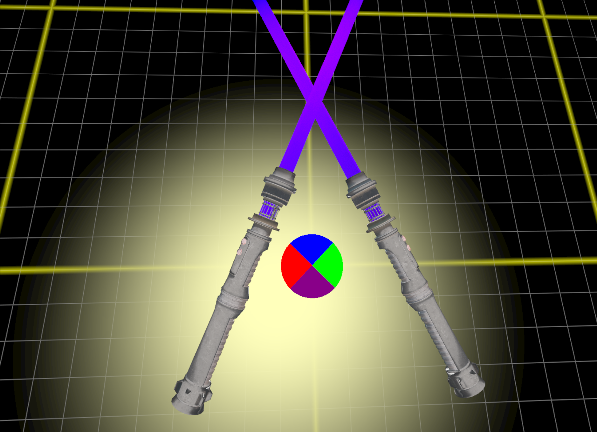
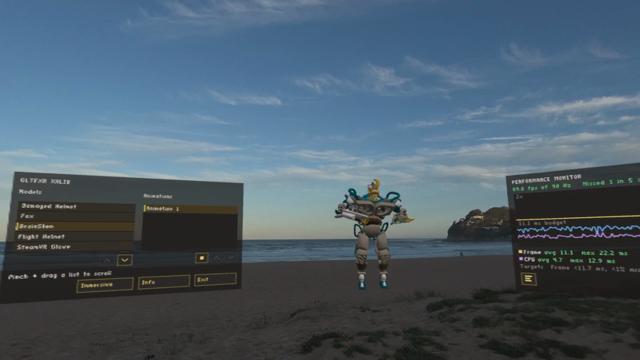

# xrlib demos
[](https://github.com/1runeberg/xrlib-demos/actions/workflows/windows_builds.yml)
[](https://github.com/1runeberg/xrlib-demos/actions/workflows/ubuntu_builds.yml)
[](https://github.com/1runeberg/xrlib-demos/actions/workflows/android_builds.yml)
[](https://github.com/1runeberg/xrlib-demos/actions/workflows/steamos_builds.yml)

OpenXR demos using [xrlib](https://github.com/1runeberg/xrlib), covering runtime
queries, rendering, passthrough, hand tracking and controller input.

## Demos

- [demo-01_checkxr](demo-01_checkxr): query the active runtime, extensions, API layers and system capabilities
- [demo-02_displayxr](demo-02_displayxr): render basic geometry with stereo views and tracked poses
- [demo-03_passthroughxr](demo-03_passthroughxr): display passthrough using the FB passthrough extension
- [demo-04_handtrackingxr](demo-04_handtrackingxr): display joint indicators for tracked hands
- [demo-05_inputxr](demo-05_inputxr): control a saber with action bindings and haptics, with PBR rendering and optional passthrough

  [](demo-05_inputxr)

- [demo-06_gltfxr](demo-06_gltfxr): display PBR glTF models in passthrough

  [](demo-06_gltfxr)

Each demo's README describes its controls and features. Extension support depends
on the device and OpenXR runtime. The shared application code lives in `xrapp/`.

## Get the demos

```sh
git clone --recurse-submodules https://github.com/1runeberg/xrlib-demos.git
cd xrlib-demos
```

For an existing checkout, initialise the dependencies with:

```sh
git submodule update --init --recursive
```

The demo builds include xrlib from the submodule automatically.

## Windows and Linux

Requires Git, CMake 3.28 or newer, a C++20 compiler and the [Vulkan SDK](https://vulkan.lunarg.com/).
Make sure `glslc` is on your `PATH` so the build can compile the demo shaders.

On Windows, install Visual Studio's Desktop development with C++ workload.

On Linux, install GCC or Clang and your hardware platform's development tools.

Run these commands from the repo root to build the desktop demos.

### Windows

```sh
cmake -S . -B build -A x64
cmake --build build --config Release --parallel
```

### Linux

```sh
cmake -S . -B build -DCMAKE_BUILD_TYPE=Release
cmake --build build --parallel
```

To build one demo after configuring, select its executable target, for example:

```sh
cmake --build build --config Release --target displayxr --parallel
```

The targets are `checkxr`, `displayxr`, `passthroughxr`, `handtrackingxr`,
and `inputxr`.

Executables, libraries and runtime assets are
copied into each demo's `bin/` folder.

### Run a demo

Set up your device's OpenXR runtime, then run the executable from its `bin/`
folder so it can find its assets. For displayxr on Linux:

```sh
cd demo-02_displayxr/bin
./displayxr
```

On Windows, run `displayxr.exe` from the same folder. Checkxr prints runtime
information to the console and exits without displaying an XR scene.

## SteamOS ARM64

Demos 01, 02 and 05 build as native Linux ARM64 apps for Steam Frame. From the
repo root, with Docker running and Linux ARM64 support enabled:

```sh
docker build --platform linux/arm64 --target packages --output type=local,dest=. -f platforms/steamos/Dockerfile .
```

Packages are exported to `<demo>/build/steamos-arm64/deploy/`. See the
[SteamOS build and deployment guide](platforms/steamos/README.md) for individual demo
builds, building directly on Linux ARM64 and uploading to Frame.

## Android

Each demo has its own Android Studio project in `<demo>/android/`.

1. Open the demo's `android` folder in Android Studio
2. In SDK Manager, install Android SDK Platform 33, the NDK and CMake 3.30.5 under SDK Tools, using Show Package Details
3. Use JDK 17 for Gradle, sync the project and build the APK
4. Install and run it on an Android device with a compatible OpenXR runtime

You can also build from the demo's Android folder:

```sh
cd demo-02_displayxr/android
./gradlew assembleDebug
```

Use `gradlew.bat assembleDebug` on Windows. APKs are written to the demo's
`android/build/outputs/apk/` folder.

## visionOS

Displayxr and gltfxr have CMake/Xcode builds for physical Vision Pro devices.
Requires Xcode with the matching visionOS SDK, CMake 3.28 or newer, `glslc` and
the [public vision-openxr SDK](https://github.com/1runeberg/vision-openxr-sdk).
Clone the SDK alongside xrlib-demos as `vision-openxr-sdk` and initialise its submodules.

The SDK includes prebuilt `VisionOpenXR.framework` and `MoltenVK.framework` binaries.
The demos link and embed these frameworks, so the private runtime source isn't needed.

Follow the [displayxr](demo-02_displayxr/README.md#visionos) or
[gltfxr](demo-06_gltfxr/README.md#build-for-visionos) visionOS build instructions
to configure, build and run the app in Xcode.

## Connect with me here:

- GitHub: https://github.com/1runeberg
- Website: http://runeberg.io
- Bluesky: https://runeberg.social
- Twitter: https://twitter.com/1runeberg
- YouTube: https://www.youtube.com/@1RuneBerg
